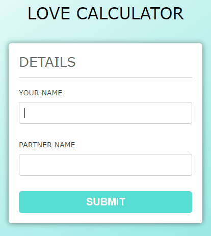

# loveCalculatorProject

  - 2명의 이름을 입력하면 API가 계산하여 궁합 퍼센트를 알려준다.

## 테스트 방법

  - npm install
  - node app.js
  - http://127.0.0.1:3000/ 접속

## 테스트 화면

  - 

## 설명

  - Node Express를 이용해 서버 생성
  - `form`에서 데이터를 입력받아 `AJAX`로 요청을 하면 `unirest API`로 궁합계산을 한 다음 받은 데이터를 응답해준다.
  - 궁합 퍼센트에 따라 `SVG` 아이콘 변경

## 문제점

  - 간헐적으로 서버에서 데이터 받는데 내용이 없음
  - `form` validation 추가

